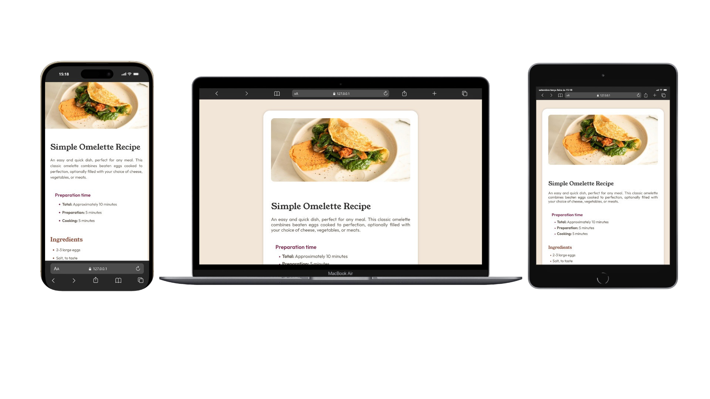

# 🍳 Recipe Page

Uma página de receita responsiva para uma omelete simples, desenvolvida como solução para o desafio [Recipe page](https://www.frontendmentor.io/challenges/recipe-page-KiTsR8QQKm), do Frontend Mentor.

## 📖 Sobre o projeto

O objetivo do projeto é reproduzir uma página de receita clara, acessível e adaptável a diferentes tamanhos de tela. A interface apresenta as informações de preparo de forma organizada e utiliza uma combinação de tipografia, cores e espaçamentos inspirada no design original do desafio.

## ✨ Funcionalidades

- Exibição responsiva da imagem principal da receita;
- Informações sobre tempo de preparo;
- Lista de ingredientes;
- Instruções de preparo numeradas;
- Tabela com informações nutricionais;
- Layout adaptado para dispositivos móveis, tablets e desktops;
- Estrutura HTML semântica para melhor organização do conteúdo.

## 🖼️ Prévia



## 🛠️ Tecnologias

- HTML5;
- CSS3;
- CSS Nesting;
- Flexbox;
- Media queries;
- Fontes [Outfit](https://fonts.google.com/specimen/Outfit) e [Young Serif](https://fonts.google.com/specimen/Young+Serif).

## 🚀 Como executar

Este é um projeto estático e não exige instalação de dependências.

1. Faça o download ou clone este repositório.
2. Abra o arquivo `index.html` no navegador.

Para uma experiência melhor durante o desenvolvimento, abra a pasta no VS Code e execute o projeto com a extensão Live Server.

## 📁 Estrutura do projeto

```text
recipe-page-main/
├── assets/
│   ├── fonts/
│   └── images/
├── index.html
├── style.css
└── README.md
```

## 🎯 Aprendizados

Este projeto foi desenvolvido para praticar:

- Construção de layouts responsivos;
- Uso de elementos HTML semânticos;
- Organização de conteúdo com listas e tabelas;
- Aplicação de fontes e variáveis CSS;
- Adaptação de imagens com o elemento `<picture>`.

## 🙌 Créditos

- Desafio: [Frontend Mentor](https://www.frontendmentor.io/);
- Solução: Lucas Albuquerque.

## 📄 Licença

Este projeto é de código aberto e está disponível sob a Licença MIT.

---

**Bom código! 🎉** Lembre-se, todo especialista foi um dia iniciante. Continue construindo, continue aprendendo!
